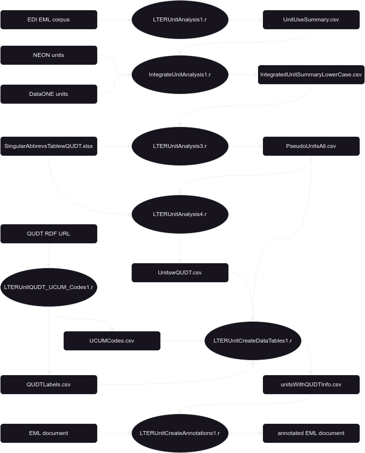

## overview

This directory contains code written by John Porter to process units obtained from Ecological Metadata Language metadata. A data directory contains some of the inputs and outputs. 

There is a PDF flow chart showing R scripts (ovals), and data inputs and outputs (rectangles). The workflow includes several major steps:

1. assembling the units lists from various sources (LTERUnitAnalysis1.r and IntegrateUnitAnalysis1.r)
2. providing a means to link similar units (IntegrateUnitAnalysis3.r) by creating "pseudounits"
3. converting pseudounits to QUDT units (IntegrateUnitAnalysis4.r) and verifying that they are in QUDT
4. linking labels and other information in QUDT and adding UCUM codes to list (LTERUnitCreateDataTables1.r)
5. draft code for processing EML documents to add <annotation> elements (LTERUnitCreateAnnotations1.r)

## workflow

